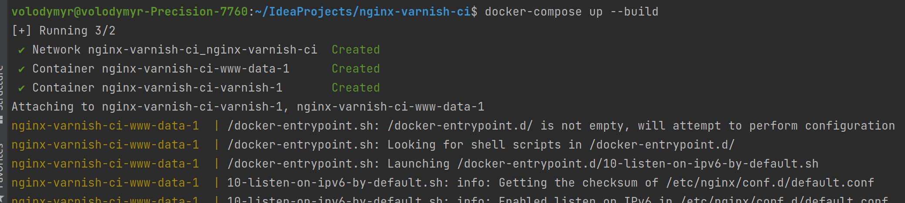
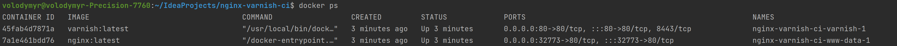
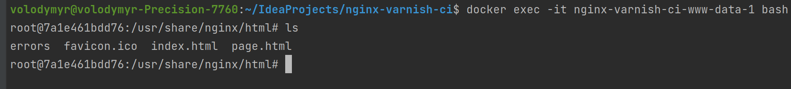
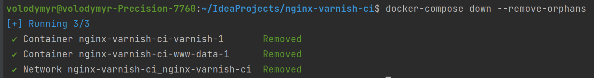
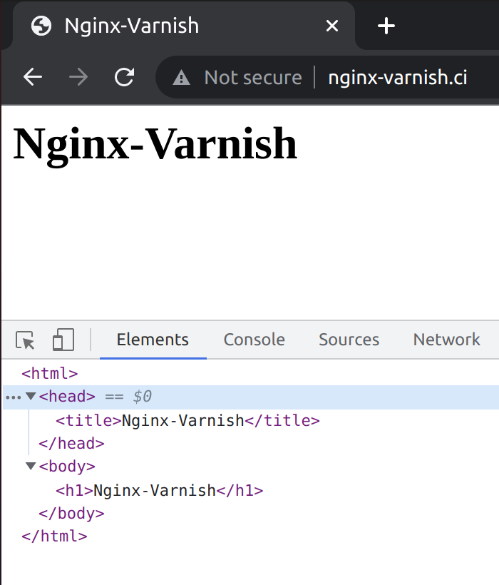
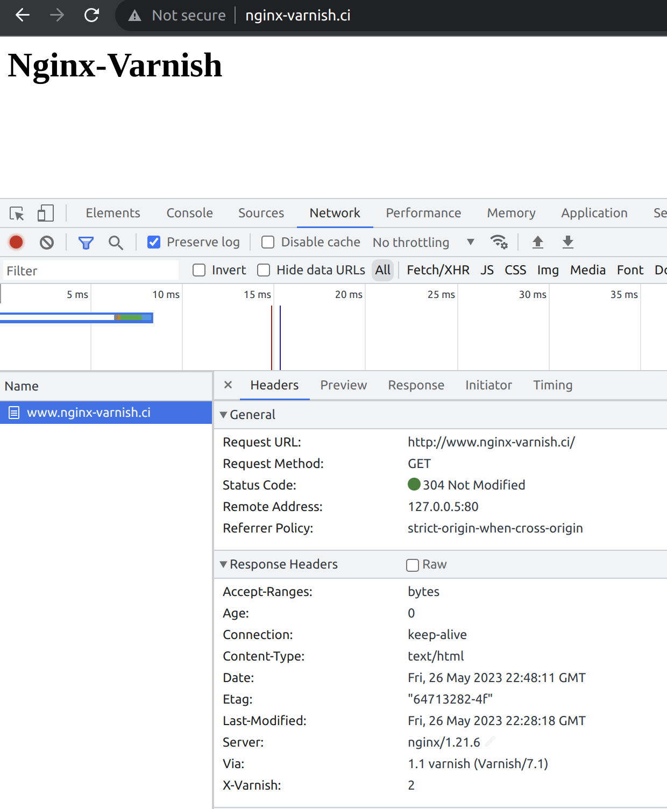
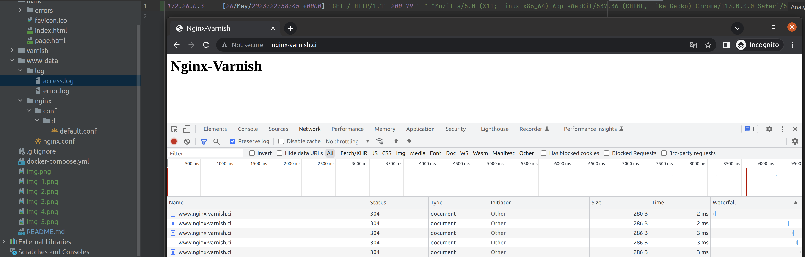
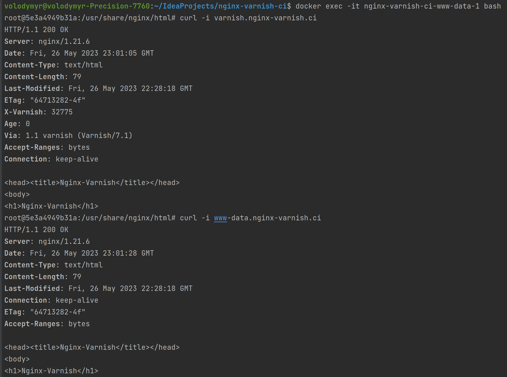

# nginx-varnish-ci
## Preconditions
A simple Docker configuration of a web-server Nginx interacting with Varnish cache.
A Varnish container exposes a port "80" outside and listens incoming connections (from a browser). 
A Nginx container contains only an internal port "80" to listen Varnish connections.

## server URLs

http://www.nginx-varnish.ci/

http://nginx-varnish.ci/

## Sample pages

http://www.nginx-varnish.ci/index.html

http://www.nginx-varnish.ci/page.html

http://www.nginx-varnish.ci/errors/404.html

http://www.nginx-varnish.ci/errors/50x.html

## Managing a Docker container
### Running a container
    docker-compose up --build

### List all running containers
    docker ps

### Entering a container
    docker exec -it nginx-varnish-ci-www-data-1 bash

### Exiting a container
    exit

### Shutting down a container
    docker-compose down --remove-orphans

## Verify Varnish is working

### Check a page content
Enter a website URL or a page URL. Check a page is properly rendered according to an HTML-template.
The page shall contain a Title at a head and a Header at a body.

### Check headers
Inspect a page. The page should contain following response headers:
    
* Server: nginx/1.21.6
* Via: 1.1 varnish (Varnish/7.1)
* X-Varnish: 2

After reloading the page a varnish header should change a value:
* X-Varnish: 32770

### Check Access Log
Reload a page several times. A file /var/log/nginx/access.log should contain only one record. 
This means after a first visit Varnish returns a cached page without any requests to Nginx.

### Check internal connections
Enter a container www-data:

    docker exec -it nginx-varnish-ci-www-data-1 bash

Perform following curl-requests:

    curl -i varnish.nginx-varnish.ci
    curl -i www-data.nginx-varnish.ci

Note that headers received from the both networks are different:

